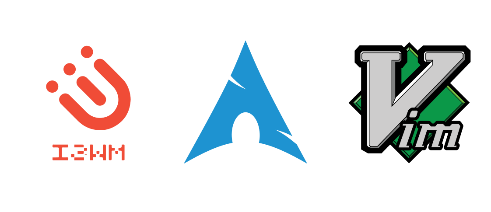

## This is configure file for anything in my linux: mint, arch
  
  

## Description  
- Vim using Pathogen
- Compton: enable transparent (case: arch)
- i3: config file to i3wm (case:arch)
- i3status: config i3 status bar in i3wm (case:arch)

## Getting Started
### Requirements
Before config
- A Linux distribution OS.
- All configuration is in Bash Shell, thus you have to install bash ( if it hasn't installed yet) then set bash as your login shell:  
`chsh -s $(which bash)`
- Install vim and update the default system editor for all users is vim instead vi by edit file ~/.bashrc:  
`alias vi="vim"`
- Create .vim folder, it will contain all our vim config file.
- Install [Git](https://git-scm.com/): [Instruction to install Git](https://gist.github.com/derhuerst/1b15ff4652a867391f03)
- Install Awesome font (Link is bottom page). Note: Use font awesome 4(the lastest font in currently - 5.0.13 has some error about display the space character after icon).
  
### Installing
* Vim config
>When you’re using a whole new computer and want to get all your vim settings from the cloud, simply clone your github repo, make a symlink for .vimrc and pull all plugins.  

```
 cd ~
 git clone https://github.com/duonghan/dotfiles .vim
 ln -s ~/.vim/vimrc ~/.vimrc
 cd .vim
 git submodule update --init && git submodule foreach git pull origin master
```

## Screenshots
I will update it soon.


## Links
- i3wm: [](https://i3wm.org/)
- Font Awesome Cheetset: [](https://fontawesome.com/cheatsheet?from=io)
- Font Awesome Download: [](https://github.com/FortAwesome/Font-Awesome/releases)
- 
## Contributing
1. Fork it (https://github.com/duonghan/dotfiles/fork)
2. Create your feature branch (`git checkout -b feature/fooBar`)
3. Commit your changes (`git commit -am 'Add some fooBar'`)
4. Push to the branch (`git push origin feature/fooBar`)
5. Create a new Pull Request

## Authors
Follow me on  
[](https://twitter.com/0xddff)
[](https://www.facebook.com/0xc0ff33)
[](https://github.com/duonghan)

## License
This project is licensed under the MIT License © 2018
